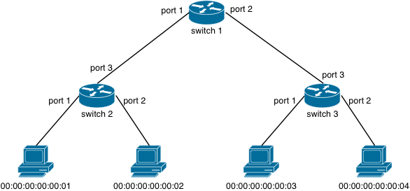

# Chapter 8: Multiple Switches (at last!)

In this chapter, you'll finally work with a multi-switch network. First, you'll write and test a routing policy. Then, you'll use the re-use firewall you wrote in the last chapter and apply it to this network. In fact, you'll learn how package your firewall into a reusable module that you can compose with any other policy. You'll accomplish this using a key feature of NetCore: _sequential composition_.

## Topology


You will work with the following tree topology:



The figure labels hosts, switches, and port numbers. You can create this topology easily with Mininet:

```
$ sudo mn --controller=remote --topo=tree,2,2 --mac
```
> `tree,2,2` creates a topology of height 2 and fanout 2


### Exercise 1: Routing

Using NetCore, write a routing policy that connects all hosts to each other. You already know how to do this for a single switch. To write a multi-switch routing policy, you can use the `switch = n` predicate as follows:

```
let routing =
  if switch = 1 then
    (* Policy for Switch 1 *)
    ...
  else if switch = 2 then
    (* Policy for Switch 2 *)
    ...
  else if switch = 3 then
    (* Policy for Switch 3 *)
    ...
  else
    drop
    
routing
```

You'll find this template in [Chapter8.nc](netcore-tutorial-code/Chapter8.nc). Fill it in.

#### Testing

Launch Frenetic in one terminal:

```
$ frenetic Chapter8.nc
```

And Mininet in another:

```
$ sudo mn --controller=remote --topo=tree,2,2 --mac
```

Then, ensure that all hosts can reach each other:
```
mininet> pingall
```

## A Reusable Firewall Using Sequential Composition

Now that basic connectivity works, your goal is to apply exactly the same access control policy you built in the
last chapter to this new network. Unfortunately, you cannot simply reuse the firewall in its current form, since it has baked-in the routing policy for the one-switch network.

Your policy from [Chapter 7][Ch7] probably has this shape:

```
let routing = (* routing for 1 switch only *)

let firewall =
  if (* traffic allowed *) then
    routing
  else
    drop
```

To truly separate the routing policy from the firewall policy, you will use NetCore's _sequential composition_  operator. Sequential composition lets you take any two policies, `P` and `Q`,
and run them in sequence:

```
P; Q
```

This form of composition is akin to pipes in Unix. You can think of `P; Q` as a way to pipe the packets produced by `P` into the policy `Q`. To achieve complex tasks, you can string a long chain of policies together, `P1; P2; P3; ...` just as you use pipes compose several different Unix programs together.

You've probably used _grep_ and pipes in Linux to filter lines of text. You can similarly use sequential composition to filter packets:

`firewall; routing`

For this to work, you do need to make one small change to `firewall`:  replace all occurrences of `routing` with  the special action `pass`. The `pass` action is the identity function on packets. When you use `pass` in a policy, you don't forward it out of a port, but simply pass it on unchanged to the next policy in a sequence.
Hopefully, it is evident that if your firewall only applies `pass` and `drop`, then it becomes truly topology-independent.

### Exercise 2: Abstracting the Firewall

In this exercise, you'll move the firewall you wrote in the last chapter to its own file, `Firewall.nc`, edit it to just `pass` and `drop` packets, and then include `Firewall.nc` into both `Chapter7.nc` and `Chapter8.nc`.

> If you didn't finish Chapter 7, use
> [Sol_Chapter7_Firewall.nc](netcore-tutorial-code/Sol_Chapter7_Firewall.nc).
> If you didn't finish the routing policy above, see
> [Sol_Chapter8_Routing.nc](netcore-tutorial-code/Sol_Chapter7_Routing.nc).

- Move the code for `firewall` function from `Chapter7.nc` into a new file called `Firewall.nc`.

- In `firewall`, you have (possibly several) occurrences of `routing` (i.e., the routing policy from Chapter 7).  
  Replace all occurrences of `routing` with `pass`.

- Modify your old `Chapter7.nc` file, changing the main expression to sequence `firewall` and `routing`:

  ```
  (* This is a sketch of Chapter7.nc *)
  include "Firewall.nc"
  
  let routing = ...
  
  firewall; routing
  ```
  
- Modify `Chapter8.nc` in exactly the same way: include `Firewall.nc` and then change the main expression to  
  `firewall; routing`.
  
You should test this firewall just as you tested it in [Chapter 7][Ch7].

Per the firewall, host `00:00:00:00:00:02` cannot send a packet to port `25` on host `00:00:00:00:00:04`.
When you compose `firewall; routing`, on which switch is that packet dropped? You should be able to answer the question by just reading your policy and inspecting the topology figure above.

